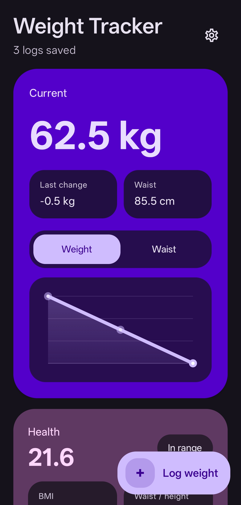
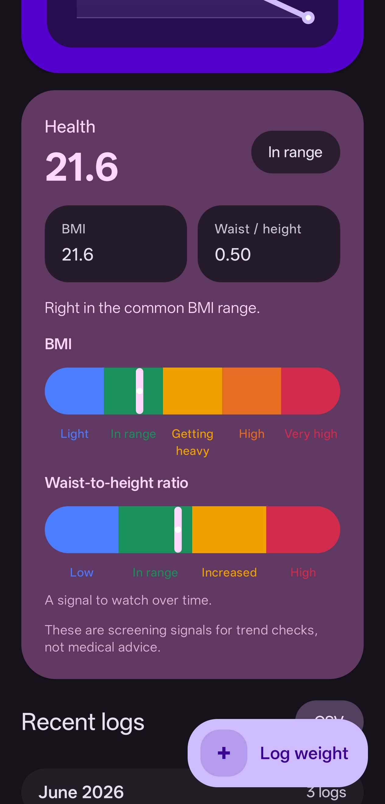
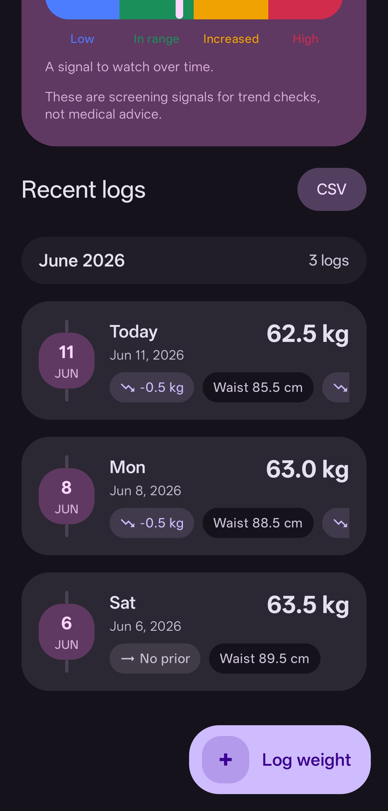
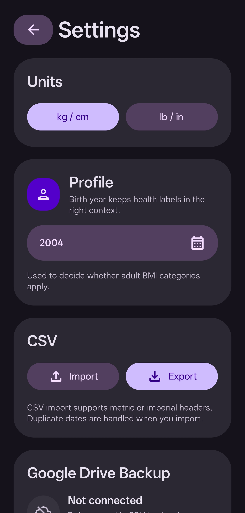
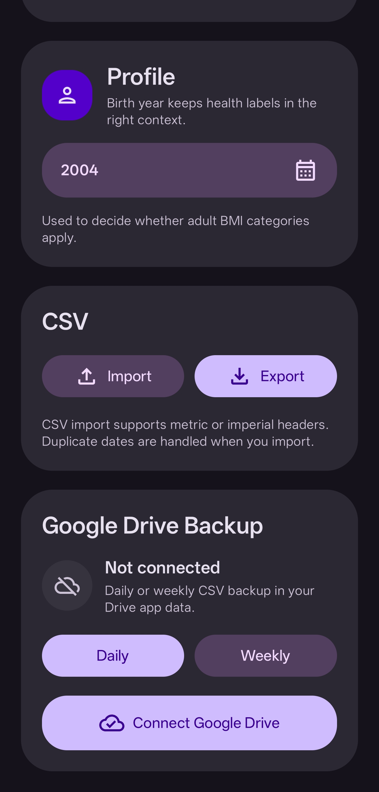

# Weight Tracker

A private, Material 3 Expressive Android app for tracking weight, waist, height, BMI, and waist-to-height ratio over time.

The app is built for quick occasional logging: open it, save today's weight, and get a clear visual read on how things are moving. Data is stored on-device by default, with optional CSV import/export and user-controlled Google Drive backup.

## Screenshots

| Current trend | Health signals |
| --- | --- |
|  |  |

| Recent logs | Settings |
| --- | --- |
|  |  |

| Backup settings |
| --- |
|  |

## Features

- Quick weight logging with optional waist and height tracking.
- Expandable cards for current weight trends, BMI, and waist-to-height ratio.
- Recent logs grouped by month with deltas and swipe-to-delete confirmation.
- CSV import/export with duplicate-date handling.
- Optional Google Drive backup to the user's private Drive app data folder.
- Material 3 Expressive styling with dynamic color and themed app icon support.
- Guided onboarding for units, profile setup, and the first log.

## Privacy

Weight Tracker stores logs locally by default. Android Auto Backup is disabled, so data is not silently backed up by the OS. Export and Google Drive backup are explicit user actions.

Google Drive backup writes a CSV backup and profile metadata to the app's private Drive app data folder. The app does not use a custom server.

## CSV Format

Exports use metric or imperial headers based on the selected unit system:

```csv
date,weight_kg,waist_cm,height_cm,bmi,waist_to_height
2026-06-11,62.5,85.5,170.0,21.6,0.50
```

Imperial exports use:

```csv
date,weight_lb,waist_in,height_in,bmi,waist_to_height
```
